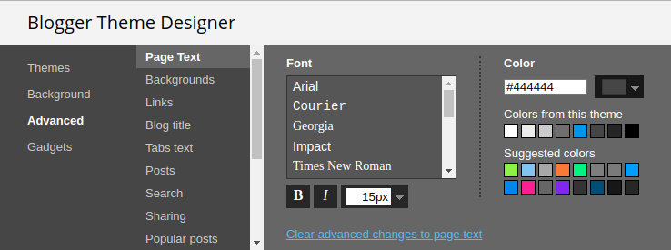
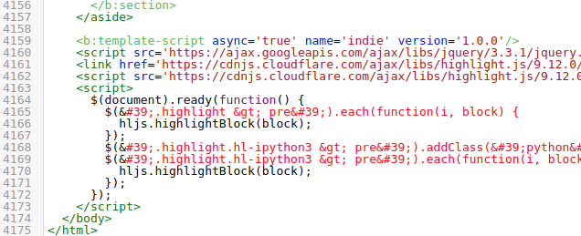

Jupyter Blogger
---------------

Turning your Jupyter notebook into a [Blogger](https://www.blogger.com) blog
post is harder than it should be.  

1. If you attempt to export a html version from Jupyter and paste it in
Blogger, the styling from the notebook will interfere with the rest of you
blog.  
1. If you use nbconvert to export a "basic" html version without any styling,
the contents of the notebook would appear illegible in Blogger. You will also
lose syntax highlighting.  

This repo has instructions to add bare-minimum css and javascript to make the
notebooks legible in Blogger and get syntax highlighting.  

1. First we add some CSS to make the code cells visually different from the
text.  
2. We then add some javascript to use [highlight.js](https://highlightjs.org/)
for syntax highlighting.  

### Step 1: Make your Blogger blog Jupyter friendly

1. The default blogger theme "Contempo" works well enough.  
1. Go to Theme > Customize and make the following changes:  
    1. Edit Advanced > Page Text > Color to #444444.  
    
    1. Go to Advanced > Add CSS, and add the following:
    ```css
    a.anchor-link {
      padding-left: 8;
      opacity: 0;
    }
    div.highlight > pre {
      border: 1px solid #cfcfcf;
      padding: 16px;
      margin-left: 16px;
    }
    div.output_subarea {
      margin-left: 16px;
      padding-left: 12px;
      font-size: smaller;
      border-left: 4px solid #cfcfcf;
    }
    ```
1. Go to back to your blog. Then Theme > Edit HTML. You will see a bunch of
html code. Scroll down to the bottom and add the following javascript right
before the closing body tag.  
```html
<script src="https://ajax.googleapis.com/ajax/libs/jquery/3.3.1/jquery.min.js"></script>
<link rel="stylesheet"
      href="https://cdnjs.cloudflare.com/ajax/libs/highlight.js/9.12.0/styles/atom-one-light.min.css" />
<script src="https://cdnjs.cloudflare.com/ajax/libs/highlight.js/9.12.0/highlight.min.js"></script>
<script>
  $(document).ready(function() {
    $('.highlight > pre').each(function(i, block) {
      hljs.highlightBlock(block);
    });
    $('.highlight.hl-ipython3 > pre').addClass('python');
    $('.highlight.hl-ipython3 > pre').each(function(i, block) {
      hljs.highlightBlock(block);
    });
  });
</script>
```

It should look something like this:  


### Step 2: Export jupyter notebook

We will use [nbconvert](https://github.com/jupyter/nbconvert) to export a basic
html version (without any stylesheet) of our notebook.  

#### Install nbconvert

```bash
sudo apt-get -y install pandoc
pip install nbconvert
```

#### Convert a notebook to basic html

```bash
jupyter nbconvert --to html --template basic <your notebook>.ipynb 
```

Copy the html generated into a Blogger post. Make sure to choose the HTML option in the Compose/HTML selector at the top.

Finally hit Publish :)

### Demo

If things go right, this is what it shoud look like: http://tensor-therapy.blogspot.com/2018/03/text-content-generation-using-lstms.html
